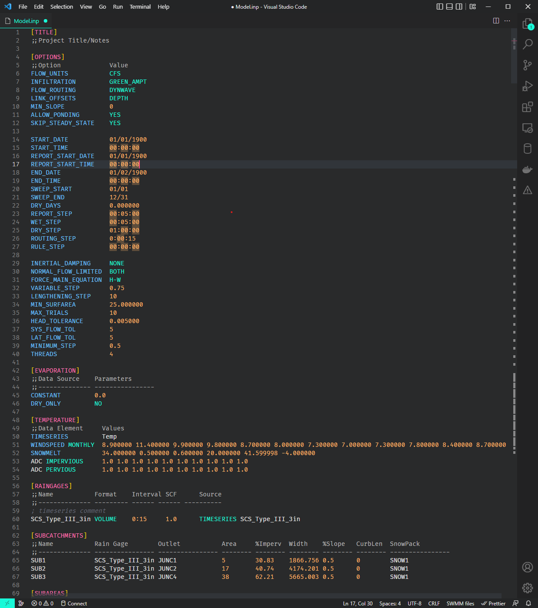

# VSC SWMM README

A SWMM visual studio code extension that provides syntax highlighting of inp files

## Quick Start

Install requirements:
1. [Node.js/npm](https://docs.npmjs.com/downloading-and-installing-node-js-and-npm)
2. VS Code Extension Manager, using npm: `npm install -g @vscode/vsce`

Install extension:
1. Clone repo (into temporary folder): `git clone  git@github.com:karosc/VSCSWMM.git --branch v0.0.1`
2. Change directory to repo folder: `cd ./VSCSWMM`
3. Package extension : `vsce package`
4. Install extension: `code --install-extension vscswmm-0.0.1.vsix`

## Notes

Extension developed based on: 
* [Microsoft Syntax Highlight Guide](https://code.visualstudio.com/api/language-extensions/syntax-highlight-guide)
* [TextMate grammer guide](https://www.apeth.com/nonblog/stories/textmatebundle.html) by Matt Neuburg
* [TextMate language grammer docs](https://macromates.com/manual/en/language_grammars) from macromates

## Future Goals
* Implement code folding for sections
* improve inp file syntax highlighting to include all SWMM features
* Add rpt file syntax highlighting
* SWMM language server for inp file validation?
